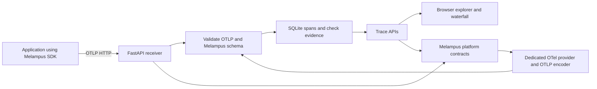

# Local intent tracing platform

The Melampus platform receives OTLP spans, persists their check evidence, and
provides a browser workflow from failed intent checks to the functions that ran.
The first version is a local, single workspace application.

## Run it

From this repository:

```sh
uv sync --locked
make run ARGS="--demo"
```

Or from an installed distribution:

```sh
pip install "."
melampus-platform --demo
```

Open **http://127.0.0.1:4318**. The default collector endpoint is
**http://127.0.0.1:4318/v1/traces**. The web interface and receiver share one port.
The `watch` receiver also defaults to 4318: choose another port if running both.

```sh
melampus-platform --port 4320 --database .melampus/workspace.sqlite3 \
  --retention-days 7 --max-spans 250000
```

The database defaults to `.melampus/platform.sqlite3`, which is Git ignored.
Starting without `--demo` creates no synthetic checkout traffic. Browsing the
explorer produces real platform self traces. Starting with `--demo`, or clicking
**Run synthetic demo**, executes 24 synthetic checkout traces using actual
Melampus checks; these traces carry a **Synthetic demo** source label.

## Connect an application

Use **Connect SDK** in the interface for an exporter snippet with the collector's
actual URL. With the Melampus SDK and OTel HTTP exporter installed in your application:

```python
from melampus import Check, instrumented
from opentelemetry import trace
from opentelemetry.sdk.resources import Resource
from opentelemetry.sdk.trace import TracerProvider
from opentelemetry.sdk.trace.export import BatchSpanProcessor
from opentelemetry.exporter.otlp.proto.http.trace_exporter import OTLPSpanExporter

provider = TracerProvider(
    resource=Resource.create(
        {
            "service.name": "my-application",
            "deployment.environment.name": "local",
        }
    )
)
provider.add_span_processor(
    BatchSpanProcessor(
        OTLPSpanExporter(
            endpoint="http://127.0.0.1:4318/v1/traces",
        )
    )
)
trace.set_tracer_provider(provider)  # Once, at application startup.


@instrumented(
    intent="Return a nonnegative total",
    checks=[Check("nonnegative", lambda r: r >= 0, "Total is nonnegative")],
)
def calculate_total():
    return 42


calculate_total()
provider.shutdown()  # Flush buffered spans before process exit.
```

The SDK owns no global tracer provider. The application continues to control
export, sampling, and flushing. A stock OTel collector can forward traces here
using its `otlphttp` exporter. This platform accepts OTLP/HTTP binary protobuf and
the [OTLP JSON mapping](https://opentelemetry.io/docs/specs/otlp/#json-protobuf-encoding),
including hexadecimal trace/span IDs and gzip bodies. It does not listen for gRPC.

An end-to-end HTTP example is included:

```sh
uv run --locked python examples/send_traces.py
# For a different port:
uv run --locked python examples/send_traces.py \
  --endpoint http://127.0.0.1:4320/v1/traces --count 24
```

## Investigate evidence

- **Failed checks** narrows the trace list to observed predicate failures.
  The initial sort puts traces with the most failed checks first.
- Search matches a function identifier or trace ID. Matching a child function
  retains the entire trace so the parent/child context remains visible.
- Filter by service, environment, outcome, or source; choose a time range or
  select a histogram interval. Live mode refreshes every five seconds.
- Open a trace to view a proportional execution waterfall. The first failed,
  errored, or incomplete span is selected automatically. Select any other span
  to read its check IDs, outcomes, sampling rates, and declaration hashes.
- **Functions** aggregates observed calls, evaluated checks, failures,
  suppressed evidence, and distinct intent hashes across the filtered traces.
- **Platform itself** selects the platform's own ingestion and query evidence.
  The **Attributes** tab identifies the function, generator, schema, and hashes.
- **System Mesh** maps declared functions, intents, and contracts alongside
  observed calls. Import an explicit catalog to include functions that have not
  run; see [System Mesh](MESH.md) for export and evidence matching.

The explorer distinguishes these outcomes:

| Trace outcome | Evidence |
| --- | --- |
| Intent drift | At least one check returned `failed` |
| Error | An application span has error status, or a check returned `error` |
| Incomplete | At least one check was sampled out, budget limited, disabled, or not executed |
| Aligned | Observed declared checks passed, with no failed, errored, or suppressed checks |
| Unverified | No declared checks were observed |

When several outcomes occur in a trace, drift takes precedence, then error, then
incomplete. The waterfall still preserves each span's exact outcome. Ordinary
context spans do not erase checked evidence. The pass rate uses only `passed`
and `failed` predicates. Check errors and suppressed checks are excluded; no
evaluated checks produces an absent rate. An aligned trace describes only the
checks actually observed, not unexercised code paths or absent spans.

## Architecture and language choice

Python was chosen over TypeScript to reuse this workspace's published SDK,
contract registration API, validators, and OTel instrumentation directly. The
platform instruments its own ingestion and queries with the same SDK it receives.
FastAPI handles HTTP; SQLite handles local persistence. The browser uses HTML,
CSS, and small JavaScript modules without Node or a frontend build requirement.
The standalone package depends on the published SDK release.



`Runtime` registers the store's ingestion, exploration, and trace lookup methods
using `melampus.instrument` and reviewed `Contract` objects. Batch decoding uses
`melampus.instrumented`. The platform owns a dedicated provider and passes its
tracer explicitly, leaving the application's global provider alone.

The self exporter serializes OTel SDK spans into OTLP protobuf, runs the same
schema validator, and writes through the original unwrapped storage method.
That last boundary prevents exporter feedback loops. Self telemetry uses an
in-process OTLP sink so readiness and shutdown do not depend on making HTTP calls
back into the server. The external HTTP example verifies the network path.
Telemetry storage failures increment visible drop counts instead of recursively
attempting to trace failed exports.

## Persistence, bounds, and scope

- One workspace; one SQLite database; one application process. Default bind is
  loopback. Team accounts, authentication, multi tenancy, and hosted deployment
  are not implemented in this local version. Keep it on a trusted local machine.
- Default capacity is 250,000 spans and retention is seven days by span end time.
  Expired spans are removed on startup, ingestion, and reads. Old incoming spans
  are discarded. A full database returns HTTP 503 with a retry hint; live data is
  never evicted silently to make space.
- Retries deduplicate by `(trace_id, span_id)`; the first accepted observation
  remains authoritative. Batch parsing and capacity admission are atomic.
- Request and decompressed body limits are 1 MiB, with at most 5,000 spans per
  batch. Queries are paginated to at most 100 traces, with time windows of at most
  seven days. SQLite serializes writes under a process lock and uses WAL mode.
- Aggregation runs over matching traces within the bounded local database.
  This is not a distributed ingestion service or a high-volume analytics engine.
- The receiver persists span IDs, names, timing, Melampus declarations/checks,
  and selected resource metadata. It discards unrelated span attributes, events,
  links, and exception messages. Function names and hashes remain visible
  identifiers; hashes are not anonymization. Ordinary OTLP declarations remain
  hash-only. System Mesh stores readable intent and contract text only through
  explicitly imported catalogs; it never derives that text from runtime hashes
  or imports predicate source.
- The synthetic demo uses actual execution times and actual predicate results.
  Its volume chart initially clusters traffic into the time of the run.

## APIs and verification

| Endpoint | Purpose |
| --- | --- |
| `POST /v1/traces` | Standard OTLP/HTTP ingestion |
| `GET /api/traces` | Search, filtering, summary, histogram, function evidence, pagination |
| `GET /api/traces/{trace_id}` | Complete stored trace and its checks |
| `GET /api/status` | Capacity, retention, schema, and self telemetry drop counts |
| `POST /api/demo` | Generate labeled synthetic SDK traces (rate limited) |
| `POST /api/catalog` | Validate and persist an explicit declaration catalog |
| `GET /api/mesh` | Declared boundaries, matching check evidence, and dependency graph |
| `GET /healthz` | Receiver readiness |
| `GET /openapi.json` | Machine readable API schema |

The tests exercise actual SDK output, binary and JSON OTLP, gzip, malformed
declarations, atomic rejection, privacy filtering, persistence, retention,
capacity, retry deduplication, trace context, pagination, and self tracing without
recursion. UI assets are checked in installed distribution smoke tests.

```sh
uv run --locked pytest tests/test_platform.py
make ci
```
